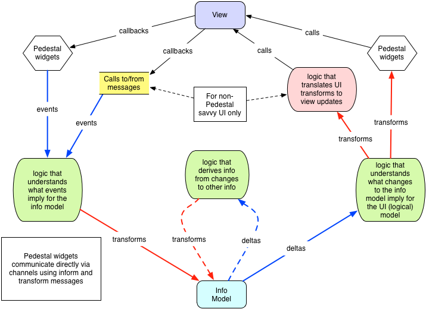
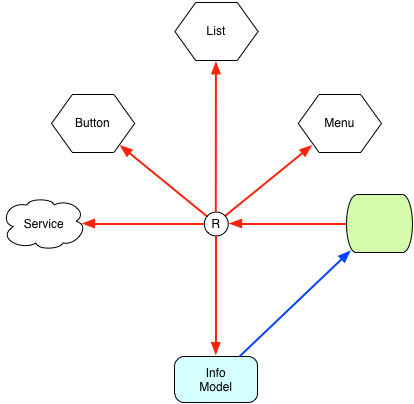
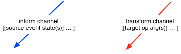
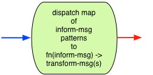
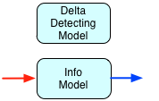
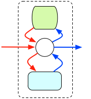
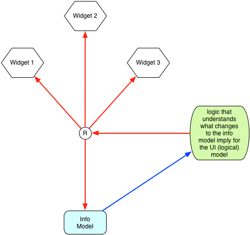
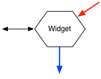

# Introduction

This document provides a description of the components of Pedestal
covering both design and API. As much as possible, we attempt to
enumerate design decisions and point out open issues. Most design
decisions are still up for discussion.

Pedestal is a set of components which is intended to provide a sound
structure and efficient execution to large `core.async` based
applications. The main focus of these components is to provide a
standard way to model change. Most of the difficulty in building large
interactive applications comes from correctly and efficiently
responding to change. How do we report changes? How do we tell
something to change? How do we know what has changed? How do we do all
of this efficiently without writing overly complex code? Providing a
good answer to these questions is the goal of Pedestal.

We often use simple examples such as clicking a button an showing a
counter increment on a screen to illustrate what the various parts
will do and how they fit together. These are not motivating
examples. For applications this simple, you don't need Pedestal. A
true motivating example is a complex application with lots of:

- screens
- widgets
- interactions with services
- state

Small programs are easy. Large programs need to have more thought put
into how they are structured. The goal of Pedestal is to help build
these larger applications by providing a well thought out structure
and a way to consistently model change. A good common solution to
these problems will allow many developers to build higher level
components on top of it.

The problems we are trying to solve a listed below:

- events

  How do we deal with incoming events? Events should cause things to
  happen. What should happen and where should the code live which
  knows about what should happen? We should avoid callbacks into
  application code by using `core.async`. What do we send on a channel
  when an event occurs?

- state

  Where does state live? Do we need to have state? How is state
  changed? Where do put the code that changes state? Which components
  are allowed to change state? After state has changed, much of the
  work of an application is to figure how what has changed and what
  effect that should have. How do we do this? Do we use atoms to store
  state? If so, how many? Do we put state in the DOM? Do we put state
  in Widgets? Where do we put state and specific to rendering only?

- views

  We don't want to assume that we are only ever using the DOM for
  views. What part of the application should be updating views? How do
  keep application logic separate from view logic? How do we manage
  changing views? For example one screen has five widgets on it and
  another screen has ten different widgets. What happens when we
  switch from on screen to another? How do we handle listening for
  events in views and converting events to data on a `core.async`
  channel?

- control

  How do we know what state the application is in? For example, we
  need to log in before we can begin using the app. We may see one set
  of widgets when we are in one state and another when we are in a
  different state. How do we transition from one screen to another?
  Where do we put the code that knows how to control the application?

- communicate

  How do we communicate with back-end services? We need to allow for
  the server to push data to the app as well as make requests. Which
  components are allowed to initiate service requests and receive
  responses from services? How do make service requests and receive
  responses? Do we make function calls or send messages?

- logic

  The logic of an application is what knows how to interpret events
  and turn them into a useful change. It may need to change data in
  the model, request some data or determine which UI components need
  to be updated based on a change to the data. Where does this live?


# Tenets

There are few things to keep in mind while reading this document.

- We prefer data over functions over macros
- Each component must work in both Clojure AND ClojureScript
- For each component, we need to be aware of where it is running
  relative to other components. Sometimes components will run
  in the same address space as other components and sometimes they
  will not
- As much as possible, we should be able to choose to user or not use
  channels. All core functionality should be implemented outside of
  channel code. Helper functions can be provided which add channels on
  top to the core interface.

An example of the third point is that we may run some components in a
web worker and others in the main JavaScript thread. We may also run
some components on the server and others in the browser. We need to
keep in mind where serialization and marshaling could happen.


# Conceptual Model

Pedestal Applications can be divided into three areas of concern: user
interfaces, services and the information model. User interfaces allow
the application to communicate with a user. Services allow the
application to communicate with external systems. The information
model stores the application's state. These areas of concern
communicate with each other using messages. There are two types of
messages:

- [*transform* messages](#transform-messages) tell the message target how to change. They
  cause a UI element or data in the data model to change. They can
  also be used to tell a service to make a request. (TBD: see open
  issue)

- [*inform* messages](#inform-messages) describe how the message source has changed. They
   notify application logic that a UI element or data in the data
   model has changed, or that a service has returned a result (TBD:
   what about async input from service via SSE or websocket? Can't
   these just be inform messages?)





## Kinds of things

In the diagram above, red arrows represent `transform channels`
(channels which convey [transform message](#transform-messages)s) and blue arrows represent
`inform channels` (channels which convey [inform message](#inform-messages)s). The green
shapes are `[dispatch map](#dispatch-map)s` which use patterns in inform message to find
functions which take the inform message and return transform
messages. These functions contain the logic which knows what an inform
message implies for other components of the application. The `info
model` stores application state and detects state deltas. `widgets`
connect to the world outside this flow of information. They can change
that world based on received transform messages and then can report
changes and generate inform messages. A widget could be a button, a
chart or something which communicates with external services. A
`router` can be used to route transform messages from one incoming
transform channel to multiple outgoing transform channels.


## Specific parts

The diagram above uses three [dispatch maps](#dispatch-map). One which receives inform
messages from widgets, one which send [transform message](#transform-messages)s to widgets
and services and one which is tied closely to the information model.

The UI->Info dispatch map is used to find functions which know what
changes to the UI imply for the information model. For example, it
might know that a button click means that a counter in the info model
should be incremented.

The Info->UI dispatch map is used to find functions which know what
changes to the info model imply for the UI. For example, when the
counter in the info models then some UI widget will need to display
the new counter value.

The Info->Info dispatch map is used to find functions which know what
changes to the info model imply for other parts of the info
model. This is how dataflow is implemented. Some of the information in
the system depends on other information. The logic for these data
connections can be put in one place instead of spreading it across all
of the places which update the base data.

The info model contains all application state in a single map. When
transforms are applied to the data it keeps track of all of the
changes that were made and reports those changes on the outgoing
inform channel.


## Processing an event

Now that we know what all the things in the diagram are, let's walk
though a complete cycle from user input to result being displayed on
the screen.

1. The user clicks a button on the screen which is backed by a widget
2. The button widget has set up an event listener for that
button. When the button is clicked, the event is converted to an
[inform message](#inform-messages) and placed on the widgets inform channel.
3. The UI->Info [dispatch map](#dispatch-map) receives the transform message and finds a
function which has been configured to handle that message based on
matching patterns in the message.
4. The function is called, passing the transform message and the function
returns one or more [transform message](#transform-messages)s.
5. The dispatch map places these transform messages on the transform
channel.
6. The info model receives a transform message and applies the
it to the model, keeping track of what has changed.
7. All changes to the model that were the result of applying one
transform to the model and reported as a single transform message on the
outgoing inform channel.
8. The Info->UI dispatch map receives an transform message from the info
model and finds the function which has been configured to handle that
message based on matching patterns in the message.
9. The function is called, passing the matched transform message and
returns one or more transform messages.
10. The dispatch map places these transform messages on the transform
channel.
11. A widget which displays the counter value on the screen receives
the transform message and changes the DOM to reflect the new value.


### Using a router

This sequence of events does not explain how [transform message](#transform-messages)s find
there way to a particular widget. That is the function of the
`router`.



When the Info->UI [dispatch map](#dispatch-map) sends transforms, a router will receive
each transform and, matching patters in the transform message, find
the outbound channel on which the transform message should be placed.

When a widget is created it will need to register itself with the
router. When a widget is destroyed, it will need to unregister.

The router can also be used to allow messages to be send back to the
info model. This allows for recursive updates which do not have to
occur at the same time as the [transaction](#transactions) that caused them.


### Flow

If the info model has calculated dependencies then the following
sequence of events may occur.

1. The info model takes a [transform message](#transform-messages) from the incoming
transform channel
2. It applies the transform and creates the [inform message](#inform-messages) which
describes the changes.
3. This inform message is put on the inform channel which goes out to
the Info->Info [dispatch map](#dispatch-map).
4. The Info->Info dispatch map takes the inform message off of the
inform channel and finds a function to generate transforms. Any
generated transforms are put on the outgoing transform channel.
5. The transform is received from the transform channel and applied to
the model.
6. Steps 3 through 5 are repeated until step 4 produces no new
transforms.
7. All changes to the info model are put into one transform message
and sent to on the outbound inform channel.


#### Comments

TBD: The sequence of events above does not describe how flow works.

TBD: Do we really need to have both a UI->Info dispatch map and a
Info->UI dispatch map? Do these two pictures represent the same
instance of a dispatch map. If we have a router then it seems like one
could do the job.

TBD: describe the widgets canvas here, including:

- the kinds of parts, e.g., red arrows are [transform message](#transform-messages)s delivered via channels, what's the green thing
- the specific parts, e.g., the map for UI->info model, info model->info model (flow), and info model->UI
- the processing an event - from a single event, e.g., button press, through all the steps to UI update


# How it works

This section of the doc will begin to layout how things work and why
they work that way.

Break out the individual parts and explain how they work

- input, output formats
- maybe include a subsection on the parts it gets wired up to w/ links to related sections
- make it so you can walk through the processing of an event by moving between these doc sections


## Messages

Messages are central to all parts of Pedestal in this section we
discuss message format.


### Component identifiers

Every message is either sent from something or to something. This
means that we need some way to identify the thing that is sending or
receiving the message.

Everything that be changed or can report having been changed has a
unique identifier. This includes user interface widgets, specific
services and individual values in the information model. All
identifiers have the same format. They are all paths represented as
vectors. Some valid identifiers are:

```clj
[:ui :button :a]
[:ui :list "bca345-b3ba-bc38a"]
[:info :counter :a]
[:services :auth]
```

By convention, identifiers are hierarchical meaning that two
identifiers with the same prefix are in some way related to each
other. For example all widgets have an identifier which starts with
`:ui`. All identifiers which start with `:info` identify a value in
the info model.

The identifiers

```clj
[:ui :list "bca345-b3ba-bc38a" :name]
[:ui :list "bca345-b3ba-bc38a" :age]
```

may refer to two different things in the same list.

Except for widgets, every component in the system makes some use of
this identifier format. [dispatch map](#dispatch-map)s [pattern match](#pattern-matching) on the identifiers
to find matching functions to transform. The router pattern matches on
identifiers to find out which channel to route the message to. The
info model uses the identifier to apply a change to a specific part of
the model.


### Inform messages

An inform message describes how something has changed. Each inform
message is a vector of multiple event entries.

```clj
[event-entry1 event-entry2 event-entry3]
```

Each event entry describes an event as a vector with `source-id`,
`event`, and zero or more `states`.

```clj
[source-id event states]
```

Examples of inform messages include:

```clj
[[[:ui :button :a] :click]]
[[[:ui :button :a] :click] [[:ui :button :b] :click]]
[[[:ui :form :register] :submit {:name "James" :age 25 :location "France"}]]
[[[:info :counter :a] :updated {:info {:counter {:a 1}} {:info {:counter {:a 1}}]]
```

The specifics of these examples are described below.

Q: why is an inform message a vector?


### Transform messages

A transform message tells something how to change. Each transform
message is a vector of multiple transformations.

```clj
[transformation1 transformation2]
```

Each transformation is a vector with `target-id`, `op` and zero or
more `arguments`.

```clj
[target-id op args]
```

Examples of transform messages include:

```clj
[[[:ui :form :register] :display-errors {:age "Error! Age must be a positive integer."}]]
[[[:info :counter :a] inc]]
[[[:info :counter :a] + 100]]
[[[:info :counter :a] inc] [[:info :counter :b] inc]]
```

The specifics of these examples are described below.

Even though we have a common format for inform and transform messages,
each component which either sends or receives them may have different
requirements for what can be sent to it or how it will report
changes. Each component will have its own API.


### Transactions

[inform message](#inform-messages)s are collections which contain multiple events which
happened at the same time. Transform messages are collections which
contain multiple transformations which should be applied at the same
time.

The best example of how these are used is in updates to the info
model. All of the transformations in a transform message are applied
at the same time. All of the changes made to the info model are
reported as one inform message indicating that they happened at the
same time.


#### Comments

Q: how do transform message set a value other than using (constantly 42)?
Q: why is transform message a vector?
Q: why do we need to have transactions?

This section describes transform and inform messages, including the
definition of the format and the use of hierarchy in ids, why they are
the way they are; use of fns as op in transform, the fact that inform
messages can have 0..n states -- inform message is a vector of event
entries, a transform message is any number of transformations in a
vector.

- there are identified parts of the app - named with paths - everything that changes has a unique id: widgets, data, services - the way we report change is the same for widgets, data, service
- change propagated using messages, messages always have a path, which are hierarchical
- hierarchy and wildcards for pattern matching and routing

Reiterate that inform msgs go inform channels and transform msgs go on transform channels


### Pattern matching

Inform and [transform message](#transform-messages)s have a similar structure. They each
start with a [component id](#component-identifiers) and then have either an event or an
operation followed by a variable number of things.

Some components below will need to find messages based on a provided
pattern. Because the variable arguments at the end of messages can be
anything, we have chosen to only pattern match against the first two
parts of a message.

A pattern is a vector with two elements. The first element matches the
component id and the second element is used to match the event or
operation. Patterns may use `:*` to mean any element and `:**` to
mean zero or more elements. Some example patterns include:

```clj
[[:**] :*] ;; any message
[[:ui :**] :*] ;; message with id starting with :ui
[[:ui :* :*] :*] ;; id starts with :ui and has exactly to other elements
[[:**] :click] ;; any click event
[[:ui :button :a] :click] ;; this exact event
[[:info :counter :*] :updated]
```

The [dispatch map](#dispatch-map) and the router use patterns like this to match
messages to functions or to channels.


## Channels



Channels are `core.async` channels. Inform channels always carry
[inform message](#inform-messages)s as described above. Transform channels always carry
[transform message](#transform-messages)s as described above.

Use core.async solves the callback problem when dealing with events
and service calls. Each component in a Pedestal application is
connected by channels rather than by making direct function
calls. This allows true disconnection of components. Each component is
in control of when it does work instead of being remote controlled
from outside forces.

There may be some places where we are using channels for no other
reason than that in a JavaScript environment we do not have threads
and we would like to ensure that the code we are writing will
interleave with other code. This is true of the implementation of
flow. In these cases, we may want to provide different implementations
for Clojure and ClojureScript.

Q: Why do we send messages instead of making direct function calls?


## Match

For some of the components below, we need to be able to match an
[inform message](#inform-messages) to either a function or a channel. For the purpose of
explanation, support that we have the following generic message:

```clj
[[[:ui :b :c] :click]
 [[:ui :e :f] :submit]
 [[:ui :f :g] :over]]
```

This message is an inform message with three event entries.

We need some way to match this message to one or more functions. We
have chosen to use a structure like the one shown below to describe
the mapping.

```clj
[[some-function [:ui :b :c] :click]
 [another-function [:ui :e :f] :*]
 [log [:ui :**] :*]]
```

Each vector above has a pattern which could match a message. Remember
that patterns are pairs that represent a [component id](#component-identifiers) and an event or
op. In the data above we do not wrap the pattern in brackets so that
the config will be more readable. Each vector could include any number
of pairs. For example:

```clj
[some-function [:ui :b :c] :click [:ui :e :f] :click]
```

is a valid config vector.

This raises a question. How do we match the message above with these
patterns and what do we pass to the function? It seems reasonable to
match functions to this message in the following way:

```clj
[some-function [[[:ui :b :c] :click]]
[another-function [[[:ui :e :f] :submit]]
[log [[[:ui :b :c] :click]
      [[:ui :e :f] :submit]
      [[:ui :f :g] :over]]]
```

Notice that each function only sees the part of the inform message
that matched its associated pattern. If instead of functions, these
were channels, routing would work in the exact same way. We are always
dealing in inform or [transform message](#transform-messages)s but those messages may be
split based on patterns.


### API

#### index

Given a config which is a vector of vectors like:

```clj
[[some-function [:ui :b :c] :click]
 [another-function [:ui :e :f] :*]
 [log [:ui :**] :*]]
```

return an index data structure that allows for fast pattern matching.

```clj
(defn index
  ([config])
  ([idx config]))
```

The single argument version builds a new index and the two argument
version adds the provided configuration to an existing index.


#### remove-from-index

The `remove-from-index` function will remove all items in the given
config from the provided index and return the new index.

```clj
(defn remove-from-index [idx config])
```


#### match

The `match` function will match items in the index to the inform
message as described above.

```clj
(defn match [idx inform])
```

The `match` function returns a set of vectors. Each vector has the
matched item, the patterns which matched the message and the matching
part of the message.

```clj
[fn-or-chan patterns message]
```

This is used by both the router and the [dispatch map](#dispatch-map) to match messages
to functions or channels.


## Dispatch Map




### what it does / why it's here

The purpose of the dispatch map is to take an [inform message](#inform-messages) as input
and produce [transform message](#transform-messages)s which go out and change some other part
of the application. An application must have some logic that does
this. Sometimes that logic is in an event handler or a controller or
anywhere else in an application.

Since all change is caused by sending a [transform message](#transform-messages) instead of
making direct function calls, the logic which knows what must change,
based on an event, produces [transform message](#transform-messages)s.

There are at least three places where a dispatch map is used in
Pedestal:

- producing transforms based on input from the UI or services
- producing UI or service transforms based on reported changes to the info model
- producing info model changes based on changes to the info model

See Channels for an explanation of why we send messages rather than
making direct function calls.

Most of the logic of an application lives in dispatch map functions. A
dispatch map function is a function that takes an inform message and
returns a vector of transforms. It returns many [transform message](#transform-messages)s
because it must be in control of how [transaction](#transactions)s are run. It can
decide if the sequence of transformations that it is producing should
be applied as one update or as many individual updates. See the
section on transactions above.

So the job of the dispatch map is to find all of the functions which
match an inform message. How this is done is described in the Match
section above. It must then produce [transform message](#transform-messages)s calling the
matched functions.


### any pertinent points about it's design

Why to dispatch map functions return multiple [transform message](#transform-messages)s? As
described above, a single [transform message](#transform-messages)s is applied as one change
and the changes are reported as having happened at one point in
time. There are times when we would like to spread some changes out
over multiple [transaction](#transactions)s. This may be for performance reasons or
because we want to see each change in the UI.

We may have an application which receives updates very quickly and
shows each update in the UI. If to many updates arrive we may decide
to start batching updates so that more than one is applied at a
time. The logic which controls this lives in dispatch map functions
and so they must be able to control transaction granularity.


### API

#### inform-to-transforms

The `inform-to-transforms` function is passed an index and an inform
message and returns a vector of [transform message](#transform-messages)s.

```clj
(defn inform-to-transforms
  ([index inform])
  ([index inform args-fn]))
```

It can optionally be passed an args-fn. By default a dispatch map
function has the signature

```clj
(defn produce-transforms [inform-message])
```

where `inform-message` is a plain old [inform message](#inform-messages). There are times
when this may not be the desired signature. For example, when watching
for changes from the info model, we may like having to deal with the
entire old and new state. The `args-fn` is a function that receives
the patterns and the inform message and then returns a vector of
arguments that will be applied to the dispatch map function.

The default implementation for this function is shown below.

```clj
(defn custom-args [patterns inform-message] [inform-message])
```


#### inform->transforms

The `inform->transforms` function takes a config that will be used to
create an index and a transform channel and returns an inform channel.

```clj
(defn inform->transforms
  ([config tchan])
  ([config tchan args-fn]))
```

It can optionally be passed an `args-fn`.

This function sets up asynchronous processing of the input inform
channel. When a message is received on the inform channel it is used
to produce [transform message](#transform-messages)s which are put on the transform channel.

Q: How can we stop this asynchronous processing?
Q: How do we handle errors?
Q: How do we configure channel buffering policy? I like what the [high
level functions in `core.async` do it](https://github.com/clojure/core.async/blob/master/src/main/clojure/clojure/core/async.clj#L893), using a `buf-or-n` optional argument.


## Information Model



### what it does / why it's here

A Pedestal application centers around its information model. This
model contains the data that the application has accumulated since it
began executing. Data for the model is received from back-end
services, user input or is calculated from other data.

There are two goals that we have when it comes to managing state:

1. control over units of work (transactions)
2. accurate and consistent change reporting
3. we would like to avoid direct connections to the model

We would like to have a clear way to indicate that one or more changes
should be part of one atomic update.

We would also like to know exactly what changed during that atomic update.

In ClojureScript, atoms give us this ability to make atomic changes
and to see the old and new value. It is not clear how we can define
clear units of work. This is difficult when the only way to update the
model is with function calls. We would need to define specific
functions for each kind of transaction that we would like to perform.

Once we have changed the data, how do we know what has changed? Most
the things that happen in an application are responding to changes in
the data model. Without having accurate change reports, we end up
doing a lot of unnecessary work. If we decide to use multiple atoms in
order to see more focused change, it makes it harder to have clear
units of work.

Changing the info model by calling functions is not ideal. A better
approach would be to decouple describing changes from applying them to
the model. This would allow us to make independent decisions about
these two activities and it gives us a way to describe units of work.

In Pedestal, the information model addresses the above issues. Changes
to the model are made by applying a [transform message](#transform-messages)
to the model. A transform message is a collection of transformations
and defines a single unit of work. All transforms are applied to the
model at the same time. An example transform message is shown below.

```clj
[[[:info :counter :a] inc]
 [[:info :user] assoc :name "Alice"]]
```

Functions appear in `op` position of transform messages that are
applied to the information model. This is okay because the dispatch
map which produces these transforms should always live in the same
address space as the information model. Applying a transformation is
basically as simple as

```clj
(apply update-in data-model [[:info :user] assoc :name "Alice"])
```

If we start with the following information model

```clj
{:info {:counter {:a 7} :user {}}}
```

The above transform would change it to

```clj
{:info {:counter {:a 8} :user {:name "Alice"}}}
```

The Pedestal information model tracks changes and reports what has
changed with an inform message.

```clj
[[[:info :counter :a] :updated {:info {:counter {:a 7} :user {}}}
                               {:info {:counter {:a 8} :user {:name "Alice"}}}]
 [[:info :user :name] :added {:info {:counter {:a 7} :user {}}}
                             {:info {:counter {:a 8} :user {:name "Alice"}}}]]
```

This inform message has two event entries, one for each change. Each
information model event entry uses the path for value that changed as
the [source id](#component-identifiers) and uses `:added`, `:updated`, or `:removed` for the
event. The two remaining items are the entire old and new state of the
model. See below for a discussion on this decision.


### any pertinent points about it's design

Using inform messages to describe changes to the information model
has had a significant effect on the design of inform messages. This
is the main motivation behind having inform messages be a vector of
event entries. We need this so that we can describe all of the changes
which happened at the same time.

It is interesting that effecting change and reporting change happens
in the same way when dealing with the UI or with information
model. This consistency leads to fewer concepts and more reusable
code.


#### states included in inform messages

Inform messages which describe changes to the information model
contain the entire old and new state.

```clj
[[[:info :counter :a] :updated {:info {:counter {:a 7} :user {}}}
                               {:info {:counter {:a 8} :user {:name "Alice"}}}]]
```

Another option would be to just include the old and new value at the
path which changed

```clj
[[[:info :counter :a] :updated 7 8]]
```

Why did we make this decision? Providing the old and new model is
strictly more information. We can use the path to get the exact values
which changed. The main reason for this decision is that this message
will be passed to a function which needs to generate transforms based
on this change. In most cases it will need to know more about the
model than exactly what changed. There are three options:

1. send on the data that changed
2. send the data that the function needs
3. send all the data

We are doing 3 and we have ruled out 1. What is wrong with option
2? In a dispatch map, we define what each dispatch map function cares
about. We could use this information to determine what data to
send. Where would we do this? How could we do this without coupling
the dispatch map with the information model? Attempting to do this in
the past has lead to complexity.

With option 3 we can generate inform messages without knowing anything
about what will consume them.

One final point is that we can always chose to show less information
in downstream processing.


#### Open Issue: large adds and removes

One problem with the above approach is that we generate a lot of
messages when we add or remove a large portion of the model. Suppose
that we have the following model:

```clj
{:info {:records {1 ["Alice" 23]
                  2 ["Bob" 42]
                  3 ["Claire" 18]}}}
```

Suppose that under `:records` we have 10,000 records and we remove
`:records` from the map. This would generate an inform message with
10,000 event entries.

Once possible solution would be to use wildcards to indicate many
changes of the same type.

```clj
[[[:info :records :*] :removed {:info {:records {1 ["Alice" 23] ...}} {:info {}}]]
```

This would indicate that each key under `:records` was removed. If
there was a lot of structure removed, many levels of nested maps, we
could use `:**`.

This would require making pattern matching a bit smarter.


#### Open Issue: vectors

We currently do not support reporting changes to vectors. This is
because we don't yet know how we would do it. The problem with vectors
is that they don't have stable keys. If we remove the first item in a
vector with 10000 items we would produce 10000 changes instead of just
one.

Maybe using a technique like the one above involving wildcards would help.


### API

The model has a simple API.

#### apply-transform

```clj
(defn apply-transform [old-model transform])
```

The `apply-transform` function takes a model and a transform message
and returns a map with keys `:model` and `:inform`.

`:model` is the updated model and `:inform` is the inform message
which describes the changes which were made to the model.

You might think that this function should just return the new model
and later we could figure out how the model changed. That assumes that
we are doing change tracking is a specific way. What if we wanted to
track changes as they happen? This is the only place that can be
done. Any other approach would force us to track changes after the
fact. This interface leaves the decision of how we track changes to
the implementation.


#### transform->inform

```clj
(defn transform->inform [data-model ichan])
```

The `transform->inform` function takes the initial data model and an
inform channel and returns a transform channel.

This function sets up asynchronous processing of transform messages,
applying those messages to the data model and putting inform messages
on the inform channel. One transform message produces one inform message.


#### Comments

Q: Is there any reason why we might just want to see the data without
changing it.


## Flow



### what it does / why it's here

Some applications don't need flow so this is an optional feature.

Flow can be used any time you have one value in the information model
that is calculated from other values. This is especially useful when
the source values may be updated in many different ways. Using flow
allows you to put the logic for updating the dependent value in one
place instead of every place that updates the source values.

Flow combines a [dispatch map](#dispatch-map) and an
[information model](#information-model) and adds fixed point logic.

Flow does the following:

1. Apply a transform message to the information model
2. Use the produced inform message to determine if any new transform messages
are created based on what has changed.
3. If new transform messages are created, apply them
4. Repeat step 2 and 3 until no new transform messages are created
5. The result is a single inform message which describes all of
changes that have been made in the information model since step 1.

Step 2 uses a dispatch map to find functions which produce new
transform messages and calls them.

In Step 3 we can get multiple transform messages. This raises the
question: how do we apply them since each one could initiate a new
flow step that generates more transform messages. The current thinking
is that it is okay to combine all of these transform messages into a
single transform message. The contract for a transform message is that
all of the transformations need to be applied at the same
time. Combining transform messages does not break this contract.


### any pertinent points about it's design

The current implementation uses channels to connect the dispatch map
and information model to one go loop which has an additional input
transform channel and output inform channel.

Using channels here is beneficial for the ClojureScript version but may
not be the best way to implement the Clojure version. This is one
place where the sources may need to diverge. For ClojureScript,
channels allow this code to interleave with other code so we don't
have to be too concerned with how long it takes a flow to complete. In
Clojure, flow could be run on a separate thread and be implemented
more simply without channels.

The channels version uses a marker message in order to know when all
transforms for a given inform message have been produced. The dispatch
map is configured to pass the marker inform message through as a
marker transform message. When a marker transform message is received
before any new transform messages, the flow is complete.


### API

The API for flow is the same and the channel API for the information
model. You interact with flow by placing a transform message on the
transform channel and then reading an inform message from the inform
channel.


#### transform->inform

```clj
(defn transform->inform
  ([data-model config ichan])
  ([data-model config ichan args-fn]))
```

The `transform->inform` function takes a data-model, a config and an
inform channel and returns a transform channel. The data-model
argument is the initial value for the information model. The config
argument is the configuration vector for the flow dispatch map. An
optional `args-fn` for the dispatch map may also be provided.

Q: In the current implementation, this is one place where we have
complected the channels version and the actual functionality.


## Router



### what it does / why it's here

When a transform message is generated from a dispatch map there are
several places that the message could go.

1. the UI to update a widget
2. the info model to change a value
3. to some service to make a request

A single dispatch map function may want to generate transform messages
to change multiple things. The example below shows a transform message
that changes three different things: a widget, services and the
information model.

```clj
[[[:ui :login] :set-state "Authenticating"]
 [[:services :auth] :authenticate {:uid "Kevin" :password "password"}]
 [[:info :login :auth] assoc :uid "Kevin" :password "password"]]
```

If the transform channel going out of the dispatch map that produced
this transform fed directly into the information model then we would
have a problem.

Instead we can have the output channel feed into a router which then
feeds multiple other transform channels. In the theoretical
application above there could be three output transform channels:

1. one for UI transforms
2. one for services transforms
3. one for information model transforms

The router would receive the message above and break it into three
distinct messages

```clj
[[[:ui :login] :set-state "Authenticating"]]
[[[:services :auth] :authenticate {:uid "Kevin" :password "password"}]]
[[[:info :login :auth] assoc :uid "Kevin" :password "password"]]
```

and each message would be sent on the appropriate channel.

A router can be configured to do this in the same what that the
dispatch map decides how to pass inform messages to functions.

A configuration for the router above would look like this:

```clj
[[ui-chan [:ui :**] :*]
 [services-chan [:services :**] :*]
 [info-chan [:info :**] :*]]
```

The UI channel would go out to widgets but each widget will have its
own input channel. Another router could be used to take messages from
the UI channel and place them on the correct widget channel.


### any pertinent points about it's design

- what happens when a message does not match an outbound channel
- how do we add and remove routes
- implemented with `match`, same as the dispatch map
- the existence of the router would allow us to have once instance of
  a dispatch map which handles all input and output
- must be able to split transform messages


### API

```clj
(defn router [id in])
```

#### Comments

Q: How do routes evolve over time?.


## Widgets



### what it does / why it's here
### any pertinent points about it's design
### API

There is currently no API for widgets.


Q: Why do we use channels to send messages to widgets instead of just
calling functions?


# Putting the pieces together

This section talks about assembling the pieces to achieve something - basically prose around the walkthrough


# Open issues

Does there need to be a way for a UI element to request data from the
data model w/o changing it?

Is `transform` really the right term? You can send a message to a
service to get data from it, that's not really a transformation.
Should you be able to read data from the info model without changing
it, or do you always have to transform it to see its state? A related
question is, how should services really work?

How would you save/load UI state to/from localstore? - current
thinking is that relevant info would have to be in information model
to save/restore UI control state.

How would you implement paging when UI can display 100 items, data
model can hold 10,000 and backed service has 10,000,000? - current
thinking is that notion of which page UI control is showing is in info
model.

If a message is sent to a map/router/dispatcher and the
src,event/target,op pair is not recognized, what should happen - i.e.,
drop the message, log an error, burn everything down, configurable?

What's the error handling model?

Are we using channels well? Policy choices - e.g. buffer size, channel
type - and assembly, meaning should channel structure be assembled
around core functions as opposed to integrated with them?

When can a function in a [dispatch map](#dispatch-map) make a call to an external
service?

We need to provide a way for functions in [dispatch map](#dispatch-map)s to do
asynchronous work. This may remove the need to interact with services
through messages. Maybe they can return channels or they could always
do work on their own go block.

What should Pedestal app include? Should it just be the things covered
by this design document or should it still include some of the tools?
I (Brenton) would favor moving everything other than this out to an
external library and then only moving things back in once they have
gone through a similar design process. We could end up shipping
moderately sized source file.
