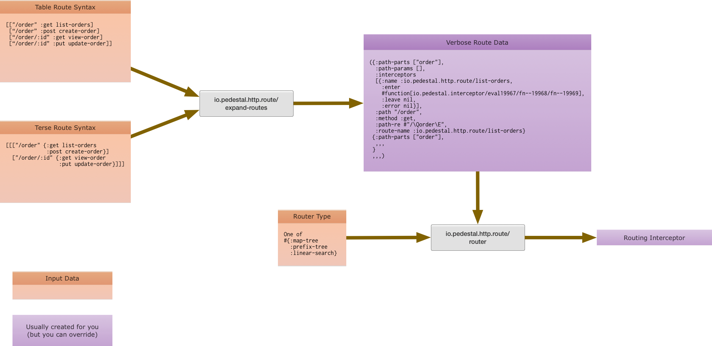

<!--
 Copyright 2013 Relevance, Inc.
 Copyright 2014 Cognitect, Inc.

 The use and distribution terms for this software are covered by the
 Eclipse Public License 1.0 (http://opensource.org/licenses/eclipse-1.0)
 which can be found in the file epl-v10.html at the root of this distribution.

 By using this software in any fashion, you are agreeing to be bound by
 the terms of this license.

 You must not remove this notice, or any other, from this software.
-->

# Pieces and Protocols

Pedestal breaks the routing mechanics into different parts, connected
by protocols. This allows you to extend or replace each of these parts
independently.

For example, Pedestal currently supports three different input formats
for routes and three different router search algorithms.

# Route Definitions

Route definitions are how the service tells Pedestal what routes exist
and what interceptors to invoke with them.

Pedestal routing is data-oriented. That's why it can support different
input formats, because `io.pedestal.http.route/expand-routes` converts
each input format to the common representation before creating a
router. The following diagram shows how the parts work together.

`io.pedestal.http.route/expand-routes` works on anything that
satisfies the `io.pedestal.http.route/ExpandableRoutes` protocol.

Because the [table syntax](service-routing.md) is written as a set, and the
[terse syntax](routing-terse-syntax.md) is written as a vector,
Pedestal extends the `ExpandableRoutes` protocol to
`clojure.lang.APersistentSet` and `clojure.lang.APersistentVector`.

## Extending or Replacing the Input Syntax

You can provide your own input format in a couple of ways.

1. Extend `ExpandableRoutes` to cover your input. Implement
   `-expand-routes` to emit the verbose maps.
2. Ignore `expand-routes` altogether and directly emit verbose maps.

# Routers

The router is just an interceptor. The job of "routing" is just
inspecting the request and pushing other interceptors onto Pedestal's
context. No magic at all.

This means a couple of interesting things:

1. You can create your own router.
2. You can put a "secondary" router in the interceptor chain below a
   "root" router.

## The Built-In Routers

Pedestal supports three different routing strategies. You select which
one to use by setting the `:io.pedestal.http/router` key in your
service map to one of the following values:

* :prefix-tree
* :linear-search
* :map-tree

### Prefix Tree

A high-performance prefix-tree router that is significantly faster and
more space efficient than other Clojure web routers. If the routes do
not use any wildcards or route parameters (e.g., `"/users/:id"), then
router will be O(log32 N). If any routes _do_ use wildcards or route
parameters then it will be O(log N) in the number of routes.

### Linear Search

Walks a sequence of routes. Performs as O(N) in the number
of routes.

### Map Tree

This router is optimized for applications with static routes
only. Ideal for applications that tunnel all parameters via entity
bodies. If your application contains path-params or wildcard routes,
the router fallsback onto a prefix-tree, via the prefix-tree router.

This router places routes in a map, keyed by URI path. A route path
is matched only by map-lookup.

## Using a Custom Router

You can set the `:io.pedestal.http/router` key in your service map to
a function instead of a keyword. Pedestal will call that function to
create the router. It should return something that satisfies the
`io.pedestal.http.route.router/Router` protocol.
