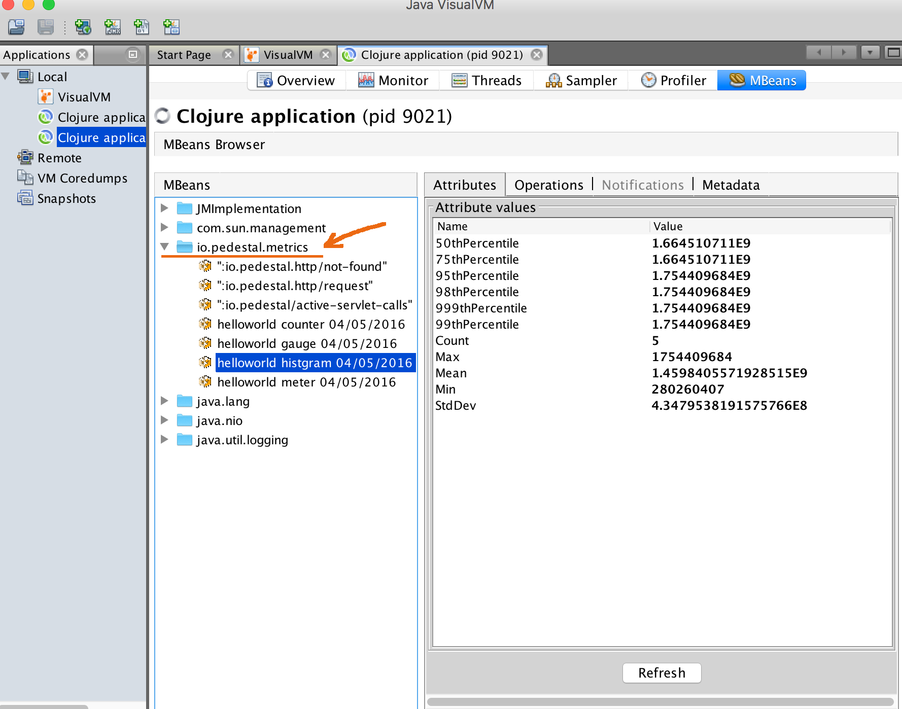

# helloworld-metrics

Pedestal offers metrics logging capabilities starting with Pedestal-0.5.0.
The default metrics recorder publishes to JMX, but you can override that
behavior by setting the JVM Property `io.pedestal.log.defaultMetricsRecorder`
or the environment variable `PEDESTAL_METRICS_RECORDER`.
The value of the setting should be a namespaced symbol
that resolves to a 0-arity function or nil.
That function should return something that satisfies the MetricRecorder protocol.

Using this capability, you can publish all metrics to your desired recorder (JMX, StatsD, CloudWatch, SLF4J, etc.)

This sample demonstrates the basic use of metrics.
Within the app, there is a [dedicated page](http://127.0.0.1:8080) to illustrate
the default metric recorder and [another page](http://127.0.0.1:8080/statsd) that
logs metrics only to [statsd](https://github.com/etsy/statsd).
The Statsd metrics are visible with the nc (netcat) command.

## Getting Started

### JVisualVM with MBeans plugin

If you have the JDK installed, you should already have JVisualVM.  You'll need the MBeans plugin though:

1. Open up JVisualVM with the `jvisualvm` command
2. Tools -> Plugins -> Available Plugins
3. Select VisualVM-MBeans and install

Alternatively, you may use jconsole which should have MBeans feature out of the box.

### JMX Metrics Reporting

1. Start the application: `lein run-dev`
2. Open VisualVM and attach to the running server JVM process
3. Go to [localhost:8080](http://localhost:8080/) to see: `Hello World!`
4. Metrics will show up on jvisualvm's MBeans tab. 
5. Reload the web page multiple times and click "Refresh" within the JVisualVM pane (bottom right).
6. Learn more! See the [Links section below](#links).

### Statsd Metrics Reporting

1. In a dedicated terminal, start nc (netcat) command to listen UDP on port 8125 (StatsD default port)

    ```
    $ nc -kul 8125
    ```

2. If necessary, start the application: `lein run-dev`
3. Go to [localhost:8080/statsd](http://localhost:8080/statsd) and reload the page multiple times
4. Within the `nc` terminal, you'll see a stream of statsd messages like below:

    ```
    :helloworld-metrics.service/statsd-hits:1|g
    :helloworld-metrics.service/statsd-hits:4|g
    ```

    You can see how many times the page has been requested.
5. Learn more! See the [Links section below](#links).


## Configuration

To configure logging see config/logback.xml. By default, the app logs to stdout and logs/.
To learn more about configuring Logback, read its [documentation](http://logback.qos.ch/documentation.html).

## Links
* [Other examples](https://github.com/pedestal/samples)

